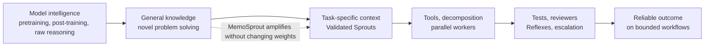
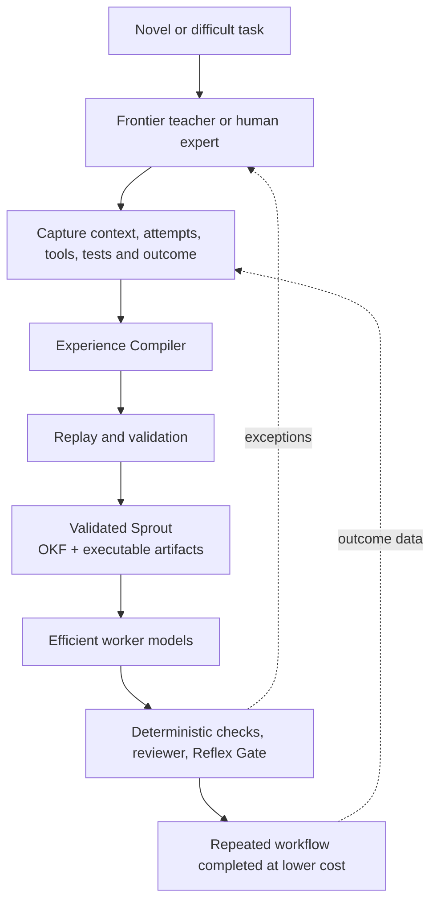
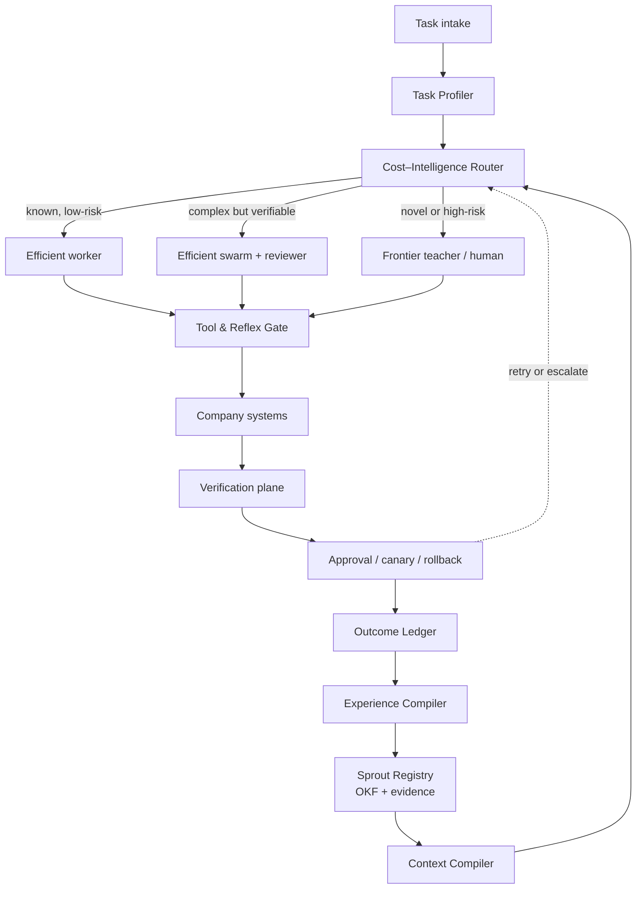
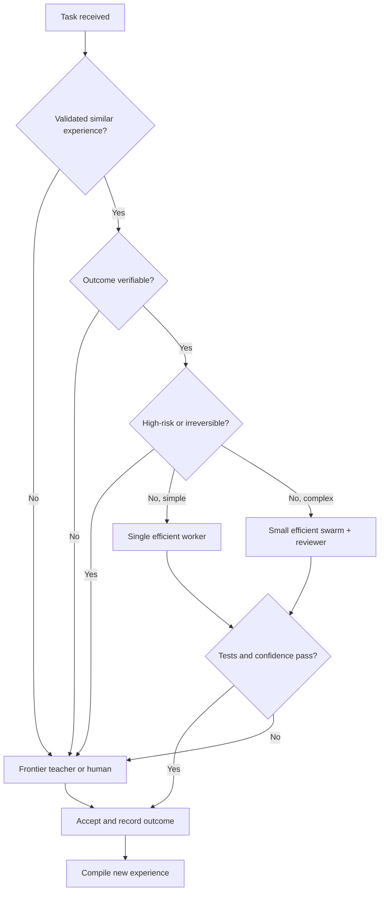
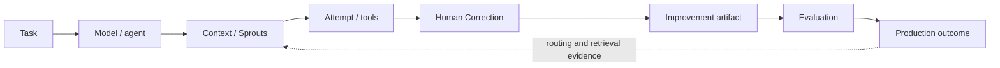
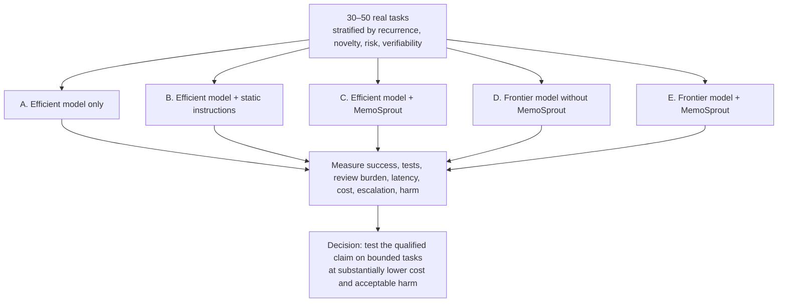
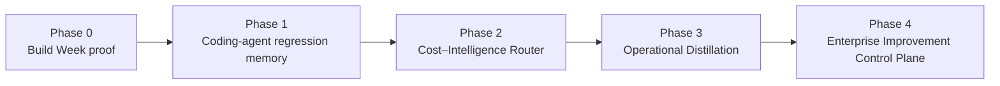

# MemoSprout Intelligence Amplification & Operational Distillation

**Strategic Product Architecture, Research Thesis, and Long-Term PRD**  
Version 1.0 — 18 July 2026

> **Build organizational intelligence once, then run it on any model.**
>
> **Correct once. Improve every agent.**
>
> **Open knowledge. Verified experience. Better agents.**

## Document Purpose

This document defines MemoSprout's long-term evolution from **agent knowledge and regression infrastructure** into an **Intelligence Amplification layer** that helps efficient models produce stronger outcomes in specific organizational workflows.

> **Scope notice:** This strategy document provides long-term product context and must not expand the current Build Week implementation scope. `docs/prd/BUILD_WEEK_PRD.md` is authoritative for the current implementation. The accepted long-term architecture described here remains intact, while Build Week must continue to prove the focused loop: Human Correction → Validated Sprout → measurable improvement.

MemoSprout turns agent outcomes and human corrections into verified, portable knowledge that improves future AI-agent runs.

This document is a strategic architecture addendum to [`docs/prd/FULL_PRD.md`](../prd/FULL_PRD.md). It does not replace the OpenAI Build Week scope or first-launch plan. It describes the long-term system that may grow from the focused Build Week proof.

---

# 1. Executive Summary

Lower-cost AI models are becoming faster, support longer contexts, tools, multimodal input, and agentic execution. In July 2026, MiMo V2.5 and DeepSeek V4 Flash list prices of approximately **$0.14 per 1M uncached input tokens and $0.28 per 1M output tokens**, while MiniMax M3 is listed at approximately **$0.30 for input and $1.20 for output** for requests of up to 512K input tokens. By contrast, GPT-5.6 Sol is listed at **$5 for input and $30 for output**, and Claude Fable 5 at **$10 for input and $50 for output** per 1M tokens. Prices may change and are not the only measure of cost, but this economic gap is large enough to create a new architectural opportunity. [S1][S2][S3][S4][S5]

However, a lower-cost model does not automatically become a frontier model merely because it receives a longer context or runs in a swarm. Fundamental reasoning capacity, generalization to new problems, judgment under ambiguity, and the ability to discover solutions without examples still come from model weights and post-training.

MemoSprout's thesis is:

> **MemoSprout improves system intelligence, not the intrinsic intelligence or model weights of a smaller language model. For recurring, organization-specific, and verifiable workflows, efficient models enhanced by MemoSprout may approach frontier-model outcomes at a substantially lower cost.**

MemoSprout accomplishes this through five mechanisms:

1. **Operational Distillation** — uses a frontier model or human expert to solve a difficult case once, then distills the context, procedure, examples, tests, failures, and Runtime Reflexes into a Validated Sprout.
2. **Context Compilation** — gives an efficient model the smallest sufficient context instead of the entire knowledge base.
3. **Cost–Intelligence Routing** — selects the model, number of workers, verifier, and escalation path based on novelty, risk, verifiability, and historical evidence.
4. **Verification Outside the Model** — uses tests, static analysis, policies, tool gates, and human approval so reliability does not depend solely on prompt compliance.
5. **Outcome Learning** — links the task, model, context, action, Human Correction, artifact, and production outcome in an Agent Outcome Graph that continuously improves routing and knowledge.

The ultimate vision is:

> **Frontier models become teachers. Efficient models become the workforce. MemoSprout becomes the system that turns verified experience into reusable operational intelligence.**

---

# 2. Claim Boundaries: What MemoSprout Can and Cannot Do

## 2.1 What MemoSprout Can Do

MemoSprout can improve **system intelligence**:

- domain awareness;
- project-specific competence;
- consistency with conventions and standard operating procedures;
- the ability to avoid known failures;
- tool discipline;
- long-horizon execution through decomposition;
- reliability through verification;
- cost efficiency through model routing;
- cross-session and cross-vendor capability;
- organizational learning from real outcomes.

## 2.2 What MemoSprout Cannot Promise

MemoSprout cannot guarantee that a smaller model has the same raw intelligence as GPT-5.6 or Claude Fable 5 for every task. It does not automatically improve:

- novel abstract reasoning without precedent;
- scientific discovery without established ground truth;
- strategic judgment with an ambiguous objective;
- systemic debugging when tests and observability are poor;
- high-stakes tasks that require a domain expert;
- generalization far beyond the available experience.

Appropriate product claim:

> **For recurring, organization-specific, and verifiable workflows, efficient models enhanced by MemoSprout may approach frontier-model outcomes at a substantially lower cost.**

Claim to avoid unless supported by strong evidence:

> “MiMo or Gemma becomes GPT-5.6.”

## 2.3 Model Intelligence vs. System Intelligence



| Dimension | Model intelligence | System intelligence |
|---|---|---|
| Source of capability | Weights and post-training | Model + context + tools + memory + control loop |
| Best suited for | Novel/general problems | Organization-specific workflows |
| How to improve it | Training, fine-tuning, stronger model | Better context, routing, tools, verification, experience |
| Portability | Model-dependent | Can be model-agnostic |
| Grounding | General | Highly organization-specific |
| MemoSprout's role | Does not change weights | Builds and optimizes the system around the model |

---

# 3. Background and Industry Context

## 3.1 Efficient Models Are Becoming Far More Capable

Several developments show that efficient models are no longer limited to simple classification or summarization:

- **MiMo V2.5** supports text, image, video, and audio input, tool calls, structured output, contexts of up to 1M tokens, and APIs compatible with the OpenAI and Anthropic protocols. [S2]
- **DeepSeek V4 Flash** supports thinking and non-thinking modes, tool use, and very low pricing; DeepSeek positions it as a fast variant with reasoning that approaches V4 Pro on some workloads. [S3]
- **Gemma 4** is available in several sizes and precision levels, enabling trade-offs among capability, memory, compute, and local deployment. [S4]
- **MiniMax M3** is positioned for coding and agentic tasks with contexts of up to 1M tokens. [S5]
- **Kimi K2.5 Agent Swarm** shows that orchestration can reduce latency by up to 4.5× relative to a single-agent Baseline Run through decomposition and parallel execution. [S6]

These developments show that intelligence does not come only from a single large model. It can also emerge from **orchestration, context, tools, verification, and accumulated experience**.

## 3.2 More Agents Are Not an Automatic Solution

An agent swarm can fail because:

- all workers repeat the same biases and errors;
- poor decomposition produces incorrect subtasks;
- communication overhead costs more than the task itself;
- voting selects the popular answer rather than the correct one;
- a weak verifier cannot distinguish a plausible solution from a valid one;
- duplicated context increases token costs;
- parallel execution increases the blast radius of tool calls.

MemoSprout does not make swarms the default. A swarm is an **execution strategy selected only when historical data demonstrates a benefit**.

## 3.3 Knowledge and Context Are Becoming Standardized

Google's Open Knowledge Format (OKF) formalizes knowledge as portable, human-readable, vendor-neutral Markdown + YAML. OKF separates producers from consumers and is intentionally a format rather than a platform. [S7]

MemoSprout uses the Open Knowledge Format (OKF) to publish the results of Operational Distillation, but its product value lies in:

- selecting experience worth retaining;
- proving that the experience is useful;
- compiling it into an operational artifact;
- selecting the model and execution strategy;
- measuring the outcome;
- controlling the lifecycle and rollback.

## 3.4 Current Gap

Organizations currently have the following components:

- strong frontier models;
- lower-cost efficient models;
- agent frameworks;
- MCP connectors;
- memory and skills;
- observability;
- eval frameworks;
- vector stores;
- CI/CD;
- human code review.

However, no single control plane yet answers the following question comprehensively:

> “How can frontier capabilities proven in real work be distilled into procedures, tests, context, and Runtime Reflexes that enable lower-cost models to complete similar future work safely?”

This is the category MemoSprout intends to build.

---

# 4. Problem Statement

## 4.1 Economic Problem

Using a frontier model for every token and every step causes:

- high inference costs;
- greater latency;
- limited throughput;
- vendor concentration;
- wasted intelligence on repetitive tasks;
- difficulty scaling to hundreds or thousands of agent workers.

## 4.2 Intelligence Reuse Problem

When a frontier model or human completes a difficult task, the organization usually retains only the final result:

- merged code;
- SOP;
- document;
- chat log;
- incident report.

Organizations rarely retain the following in a structured form:

- which context matters;
- which steps are genuinely necessary;
- which failed attempts must be avoided;
- which tests prove success;
- which tool order is effective;
- when the procedure applies;
- when to escalate;
- whether an efficient model can reproduce the outcome.

As a result, frontier intelligence is purchased repeatedly for work that should already have become institutional competence.

## 4.3 Reliability Problem

Efficient models can produce output that appears correct but is invalid. Adding memory or examples is insufficient because:

- an agent can ignore instructions;
- retrieved experience may be irrelevant;
- outdated knowledge can damage the result;
- low confidence is not always apparent from the output;
- multi-agent consensus can still be wrong;
- a semantic judge can score a plausible answer highly.

Therefore, MemoSprout must prioritize **verifiable outcomes**, not merely fluent outputs.

## 4.4 Routing Problem

Without historical data, an organization does not know:

- which tasks can use a single efficient model;
- which tasks need a small swarm;
- which tasks require a stronger reviewer;
- when to call a frontier teacher;
- how much context is minimally necessary;
- whether caching, batching, or a local model is more efficient;
- which model is best for a particular task;
- whether a model upgrade genuinely improves outcomes.

---

# 5. Product Thesis

## 5.1 Core Thesis

> **The intelligence most valuable to an organization is not only a model's general knowledge, but the verified operational competence accumulated through real work.**

MemoSprout turns that competence into a reusable asset.

## 5.2 Operational Distillation

Operational Distillation is the process of distilling the success of a frontier model or human expert into artifacts that can be reused without retraining model weights.

Unlike traditional model distillation:

| Model distillation | Operational Distillation |
|---|---|
| Changes the student model's weights | Does not change weights |
| Requires a training pipeline and compute | Uses runtime context, tools, tests, and policies |
| General capability transfer | Workflow-specific competence transfer |
| Updates are relatively slow | Can update after every validated outcome |
| Difficult to audit per decision | Artifacts and evidence can be inspected |
| One student model | Can be used by many models/vendors |
| Risk of catastrophic forgetting | Does not change the base model |

## 5.3 Operational Distillation Loop



## 5.4 Resulting Value Proposition

For organizations:

> **Pay frontier cost once for a genuinely new problem. Reuse the verified experience across efficient models for future repetitions.**

For developers:

> **Use the best model when necessary, not by default.**

For enterprises:

> **Separate organizational competence from any single model vendor.**

---

# 6. Solution Overview

MemoSprout Intelligence Amplification consists of eight subsystems:

1. **Task Profiler**
2. **Sprout Registry and OKF Knowledge Plane**
3. **Context Compiler**
4. **Cost–Intelligence Router**
5. **Execution Orchestrator**
6. **Verification and Reflex Plane**
7. **Outcome Ledger and Agent Outcome Graph**
8. **Experience Compiler and Improvement CI/CD**

## 6.1 Reference Architecture



---

# 7. Subsystem Specifications

## 7.1 Task Profiler

### Purpose

Create a structured task profile before selecting a model or context.

### Inputs

- user request;
- repository/workspace;
- available tools;
- deadline/SLA;
- risk classification;
- expected output;
- acceptance tests;
- historical task similarity;
- data sensitivity;
- maximum budget.

### Outputs

```typescript
interface TaskProfile {
  taskType: string;
  noveltyScore: number;        // 0..1
  recurrenceScore: number;     // 0..1
  verifiabilityScore: number;  // 0..1
  riskLevel: "low" | "medium" | "high" | "restricted";
  ambiguityScore: number;      // 0..1
  estimatedContextTokens: number;
  requiredCapabilities: string[];
  allowedModels: string[];
  allowedTools: string[];
  budget: {
    maxUsd: number;
    maxLatencySeconds: number;
  };
}
```

### Decision Principles

- High recurrence + high verifiability → efficient model first.
- Low recurrence + low verifiability → frontier or human earlier.
- High risk → deterministic gating and approval regardless of model.
- Similar Validated Sprouts → lower need for frontier reasoning.
- No credible acceptance criteria → do not claim successful automation.

## 7.2 Sprout Registry

A Sprout stores reusable operational competence.

### Sprout Types

- `Knowledge`
- `Validated Procedure`
- `Agent Experience`
- `Known Failure`
- `Worked Example`
- `Acceptance Test`
- `Tool Strategy`
- `Escalation Rule`
- `Runtime Reflex`
- `Model Routing Evidence`

### Required Attributes

```yaml
type: Agent Experience
title: Idempotent payment callbacks
memosprout:
  profile: operational-distillation
  profile_version: "1.0"
  status: validated
  trigger:
    task_types: [payment-webhook]
  scope:
    repositories: [payments-api]
  procedure:
    - use provider event id as idempotency key
    - protect terminal states
    - create order inside transaction
  known_failures:
    - duplicate order creation
    - paid state downgraded to pending
  verification:
    deterministic_tests:
      - duplicate-event
      - out-of-order-event
      - rollback-on-failure
  routing_evidence:
    efficient_model_success_rate: 0.92
    frontier_model_success_rate: 0.96
    replay_tasks: 25
  authority:
    approved_by: backend-platform-team
  lifecycle:
    last_tested: 2026-07-18
    review_after: 2026-10-18
```

## 7.3 Context Compiler

### Goal

Produce the smallest context capsule sufficient for the task instead of including all available memory.

### Context Components

- objective and constraints;
- relevant validated procedures;
- the closest examples;
- known failures;
- required tests;
- tool instructions;
- data sensitivity policy;
- escalation conditions;
- evidence links.

### Optimization Objectives

```text
maximize expected task success
subject to:
- token budget
- privacy constraints
- freshness
- authority
- low contradiction
- minimal distraction
```

### Context Quality Metrics

- retrieval precision;
- retrieval recall on successful historical tasks;
- token efficiency;
- stale knowledge rate;
- contradiction rate;
- instruction adherence;
- success delta vs no context.

## 7.4 Cost–Intelligence Router

### Purpose

Select the **cheapest reliable execution plan**, not the model with the lowest absolute price.

### Routing Dimensions

- task novelty;
- task risk;
- task verifiability;
- historical success per model;
- available Sprouts;
- context size;
- expected output length;
- latency requirement;
- privacy/data residency;
- tool availability;
- cost of failure;
- escalation cost.

### Routing Flow



### Example Policy

```typescript
if (task.riskLevel === "restricted") {
  return frontierWithHumanApproval();
}

if (
  task.recurrenceScore > 0.75 &&
  task.verifiabilityScore > 0.80 &&
  matchingSprouts.length >= 1
) {
  return cheapWorkerWithDeterministicVerifier();
}

if (
  task.verifiabilityScore > 0.70 &&
  task.ambiguityScore < 0.55
) {
  return cheapSwarmWithStrongReviewer();
}

return frontierTeacher();
```

## 7.5 Execution Orchestrator

### Supported Strategies

1. **Single worker** — simple, known task.
2. **Planner + worker** — task needs decomposition but one implementation path.
3. **Parallel candidates** — multiple solutions can be tested objectively.
4. **Worker + critic** — reviewer catches rule violations.
5. **Research swarm** — independent retrieval paths, then synthesis.
6. **Frontier teacher** — novel or high-risk task.
7. **Human-in-the-loop** — authority or judgment cannot be delegated.

### Swarm Constraints

- hard cap workers per task;
- no duplicated role without reason;
- per-worker token budget;
- shared context only when necessary;
- isolated tool permissions;
- deterministic aggregation when possible;
- measurable benefit requirement.

A swarm strategy is retained only if historical outcome shows improvement after accounting for cost and latency.

## 7.6 Verification Plane

Verification is the main boundary between “cheap output” and “reliable outcome.”

### Verification Hierarchy

```text
Deterministic tests
  > static analysis
  > schema and invariant checks
  > independent tool evidence
  > strong-model reviewer
  > semantic judge
  > self-reported confidence
```

### Verification Mechanisms

- unit/integration tests;
- type checking;
- build/lint;
- Semgrep or custom static rules;
- database constraints;
- structured schema validation;
- calculation recomputation;
- source citation checks;
- policy engine;
- adversarial test set;
- human approval;
- canary deployment;
- production outcome monitoring.

### Confidence Is Not Proof

Model confidence cannot be the sole acceptance criterion. MemoSprout stores confidence as one feature, but acceptance must use external evidence whenever available.

## 7.7 Runtime Reflex Gate

A Reflex is an executable intervention outside model context.

Examples:

- block direct edits to generated files;
- require approval before production deployment;
- prevent terminal payment-state downgrade;
- deny external content as authority for financial actions;
- redact credentials before external inference;
- force schema-first changes;
- limit destructive command scope.

The Reflex Gate ensures model replacement does not remove safety controls.

## 7.8 Outcome Ledger and Agent Outcome Graph

### Why It Matters

Raw traces are commodity telemetry. MemoSprout's compounding asset is the relationship between:

```text
Task
→ model and agent version
→ context and Sprouts
→ attempts and tools
→ Human Correction
→ generated artifact
→ evaluation
→ production outcome
```



### Outcome Examples

Coding:

- tests passed;
- PR merged/rejected;
- review comments;
- time to merge;
- regression after deployment;
- rollback;
- incident.

Support:

- issue resolved;
- customer escalation;
- wrong refund;
- response time;
- satisfaction;
- policy violation.

Operations:

- task completion;
- exception rate;
- approval required;
- manual correction;
- SLA;
- financial impact.

## 7.9 Experience Compiler

### Inputs

- successful frontier run;
- failed cheap run;
- Human Correction;
- test evidence;
- production outcome;
- tool trace;
- context used;
- prior related Sprouts.

### Outputs

- candidate procedure;
- minimal context;
- worked examples;
- anti-patterns;
- test suite;
- static detector;
- Runtime Reflex;
- routing policy;
- escalation condition;
- OKF artifact.

### Lifecycle

```text
Observed
→ Candidate Sprout
→ Evidence check
→ Replay
→ Human review
→ Validated Sprout
→ Canary
→ Active
→ Monitored
→ Revised / Retired
```

---

# 8. End-to-End Flow

## 8.1 First Occurrence of a Novel Task

1. Task Profiler identifies low recurrence or missing experience.
2. Router selects frontier teacher or human expert.
3. Task is executed with full tools and verification.
4. MemoSprout records context, actions, failures, tests, and outcome.
5. Experience Compiler generates Candidate Sprouts.
6. Candidate is replayed against variants and historical tasks.
7. Human approves validated procedure and enforcement artifacts.
8. Sprout is published as OKF and indexed.

## 8.2 Repeated Task

1. Similar task arrives.
2. A matching Validated Sprout is found.
3. Context Compiler produces minimal capsule.
4. Router selects efficient worker or small swarm.
5. Worker executes with tool permissions and Reflex Gate.
6. Tests verify result.
7. Success is recorded; no frontier call needed.
8. If verification fails, task escalates and produces new learning.

## 8.3 Workflow Example: Generated Code

First time:

- frontier model edits generated file incorrectly;
- human corrects: modify schema, run generator;
- Codex creates deterministic check;
- replay proves check catches violations without blocking valid changes;
- Sprout becomes active.

Next time:

- efficient model receives schema-first procedure;
- direct edit is blocked by Reflex;
- generator and tests run;
- task succeeds at lower cost.

## 8.4 Workflow Example: Payment Callback

First time:

- duplicate callback produces duplicate order;
- expert fixes idempotency and state invariants;
- MemoSprout stores procedure, tests, and known failures;
- replay validates against duplicate and out-of-order events.

Next time:

- efficient model implements a new provider integration;
- relevant Sprout is injected;
- tests enforce idempotency;
- frontier model is only called if provider semantics are novel or ambiguous.

---

# 9. Comparison with Alternative Approaches

| Approach | Strength | Limitation | MemoSprout difference |
|---|---|---|---|
| Use frontier model everywhere | Best raw capability | Expensive; intelligence repurchased repeatedly | Frontier only for novelty and exceptions |
| Use cheap model everywhere | Low cost | Lower reliability on complex tasks | Context, verification, routing, escalation |
| Long system prompt | Simple | Bloated, stale, ignored, hard to measure | Task-specific compiled context |
| RAG | Retrieves information | Does not prove procedure works | Validated Sprout + outcome evidence |
| Agent memory | Persists facts | Memory can be wrong or harmful | Candidate → replay → approval lifecycle |
| Fine-tuning | Improves model behavior | Training cost, vendor/model coupling, slow updates | Runtime, portable, auditable, no weight change |
| Agent swarm | Parallelism and breadth | Cost/coordination can explode | Used only when historical benefit is proven |
| Static guardrails | Deterministic control | Rules must be known and authored manually | Can grow from a Validated Sprout |
| Model router | Cost optimization | Often based on generic benchmark | Organization-specific Agent Outcome Graph |
| OKF alone | Portable knowledge | No eval, runtime, routing, or outcome loop | MemoSprout operationalizes OKF |

---

# 10. Model Roles and Provider Strategy

MemoSprout must remain model-agnostic. Provider names below are deployment examples, not hard dependencies.

## 10.1 Tier A — Efficient Workers

Use for:

- known recurring tasks;
- extraction and classification;
- repository browsing;
- boilerplate implementation;
- transformation following validated procedure;
- candidate generation;
- summarizing tool evidence.

Candidates:

- MiMo V2.5;
- DeepSeek V4 Flash;
- Gemma 4 local/open-weight deployments;
- MiniMax M3;
- future efficient models.

## 10.2 Tier B — Strong Workers and Reviewers

Use for:

- decomposition;
- conflict resolution;
- code review;
- ambiguous context compression;
- semantic verification;
- complex but bounded tasks.

Candidates depend on benchmark, privacy, and cost.

## 10.3 Tier C — Frontier Teachers

Use for:

- novel task classes;
- high-impact reasoning;
- causal analysis;
- creating difficult evals;
- resolving policy conflicts;
- adjudicating disagreement;
- extracting generalized procedure from sparse evidence.

Examples:

- GPT-5.6 Sol;
- Claude Fable 5;
- future frontier models.

## 10.4 Human Expert

Required when:

- legal or compliance authority is needed;
- acceptance criteria are inherently subjective;
- data is insufficient;
- model disagreement remains high;
- action is irreversible and high-impact;
- task is outside approved automation policy.

---

# 11. Economics and Cost Model

## 11.1 Current List-Price Context

The following figures are snapshots from official provider pages on 18 July 2026 and can change:

| Model | Input / 1M | Output / 1M | Notes |
|---|---:|---:|---|
| MiMo V2.5 | $0.14 cache miss | $0.28 | $0.0028 cache hit; 1M context [S2] |
| DeepSeek V4 Flash | $0.14 cache miss | $0.28 | $0.0028 cache hit [S3] |
| MiniMax M3 | $0.30 up to 512K | $1.20 | higher rate above 512K; cache read $0.06 [S5] |
| GPT-5.6 Luna | $1.00 | $6.00 | standard short context [S1] |
| GPT-5.6 Terra | $2.50 | $15.00 | standard short context [S1] |
| GPT-5.6 Sol | $5.00 | $30.00 | standard short context [S1] |
| Claude Fable 5 | $10.00 | $50.00 | prompt cache read $1 [S8] |

Gemma 4 is open-weight; actual cost depends on hardware, quantization, throughput, and provider. [S4]

## 11.2 Cost Is Not Price per Token Alone

Total task cost includes:

```text
model tokens
+ repeated attempts
+ tool execution
+ latency
+ human review
+ failure cost
+ incident risk
+ infrastructure
```

A cheap model that fails five times can be more expensive than one frontier call. MemoSprout optimizes **expected cost per verified successful outcome**.

## 11.3 Core Optimization Metric

```text
Expected Verified Outcome Cost (EVOC)
= inference cost
+ tool cost
+ expected review cost
+ probability of failure × failure impact
+ escalation cost
```

Router objective:

```text
minimize EVOC
subject to:
- required success probability
- latency SLA
- privacy policy
- risk tolerance
```

## 11.4 Illustrative Scenario

Suppose a recurring coding task consumes 100K input and 20K output tokens.

- A frontier Sol call at list price is approximately $1.10 before tool and retry costs.
- A MiMo/DeepSeek-class call at list price is approximately $0.0196.

The theoretical token-price difference is large, but MemoSprout should only route to the efficient model if tests and historical evidence indicate comparable success.

The product value is not “cheapest tokens.” It is **cheapest verified outcome**.

---

# 12. Evaluation and Research Plan

The thesis must be proven empirically. MemoSprout should treat this as a product benchmark program, not marketing intuition.

## 12.1 Research Question

> For recurring, repository-specific, objectively verifiable tasks, can an efficient model with MemoSprout approach the success rate of a frontier model without MemoSprout at a materially lower cost?

The claim boundary for this research is: **For recurring, organization-specific, and verifiable workflows, efficient models enhanced by MemoSprout may approach frontier-model outcomes at a substantially lower cost.**

## 12.2 Experimental Configurations



## 12.3 Dataset Construction

Use real tasks from:

- MemoSprout;
- Denahku;
- Conversease;
- Tilaqa;
- RepoSweep;
- other repositories with adequate tests.

Task strata:

1. repeated and deterministic;
2. repeated but partially semantic;
3. repository-specific novel variation;
4. truly novel;
5. low risk;
6. high risk;
7. short context;
8. large repository context.

## 12.4 Metrics

### Quality

- task success rate;
- first-pass test success;
- hidden test success;
- reviewer acceptance;
- regression rate;
- factual accuracy;
- policy compliance.

### Efficiency

- total input/output tokens;
- wall-clock latency;
- number of workers;
- retries;
- frontier escalation rate;
- total inference cost;
- human review minutes.

### Safety and Harm

- false guidance rate;
- false blocking rate;
- harmful action rate;
- stale Sprout usage;
- unauthorized data exposure;
- human override rate.

### Learning

- Sprout reuse rate;
- success delta after Sprout;
- cost reduction after validation;
- time until experience becomes stale;
- transferability across models and repositories.

## 12.5 Success Thresholds for Early Validation

These are hypotheses, not established results:

- Within the qualified claim boundary, efficient model + MemoSprout reaches at least 85–95% of frontier-model task success on selected recurring tasks.
- Verified outcome cost decreases by at least 50% on those tasks.
- Frontier escalation decreases over repeated workflow classes.
- Harm rate does not increase materially.
- False blocking remains below 1–2% for deterministic Reflexes.
- At least 30% of Validated Sprouts are reused.

## 12.6 Kill Criteria

Reconsider the thesis if:

- efficient models remain far below frontier after high-quality context and tools;
- tests cannot represent real success;
- Sprouts frequently overfit one task;
- frontier escalation stays above 70–80%;
- replay cost exceeds saved inference/review cost;
- false guidance creates more work than it saves;
- model providers add equivalent organization-specific outcome learning natively;
- teams refuse trace access due to privacy concerns.

---

# 13. Privacy, Security, and Data Governance

## 13.1 Privacy Principle

> **Customer experience data belongs to the customer.**

MemoSprout must not require raw source code, conversations, or documents to leave the customer environment when local/private deployment is chosen.

## 13.2 Deployment Modes

### Local Developer Mode

- local SQLite or embedded store;
- local OKF bundle;
- local MCP server;
- optional cloud inference;
- secrets scanner;
- no telemetry by default.

### Team Cloud Mode

- encrypted tenant isolation;
- configurable retention;
- provider transparency;
- BYOK;
- workspace permissions;
- audit logs.

### Enterprise Edge/VPC Mode

- source code and raw traces remain in customer VPC;
- local embeddings/retrieval;
- customer-managed keys;
- local or approved models;
- cloud control plane receives only metadata/hashes if configured;
- no external inference mode.

## 13.3 Data Classification

```typescript
type DataClass =
  | "public"
  | "internal"
  | "confidential"
  | "restricted";
```

Routing policy must consider data class:

- public → any approved provider;
- internal → provider with suitable retention terms;
- confidential → enterprise endpoint, BYOK, or private model;
- restricted → local/VPC only unless explicit approval.

## 13.4 Poisoning Prevention

Untrusted content cannot directly become active knowledge or policy.

```text
Untrusted source
→ candidate evidence
→ authority check
→ validation
→ human approval
→ active Sprout
```

## 13.5 Cross-Organization Learning

A future global network must be opt-in and share only generalized patterns, benchmark metadata, or signed Reflex packages—not raw prompts, code, customer identity, or documents.

---

# 14. Product Experience

## 14.1 Core Dashboard

### Intelligence Overview

- verified tasks completed;
- cost saved vs. a frontier-only Baseline Run;
- frontier escalation rate;
- successful efficient-model runs;
- active Sprouts;
- prevented repeated failures;
- average confidence and verifier coverage.

### Routing Explorer

For each run:

```text
Task classified as:
- recurring: 0.91
- verifiable: 0.94
- risk: low
- matching Sprouts: 3

Selected plan:
- MiMo V2.5 worker
- deterministic test runner
- no frontier reviewer

Estimated cost: $0.03
Frontier Baseline Run: $1.18
Outcome: passed all tests
```

### Distillation Inbox

Candidate Sprout:

- source run;
- teacher model;
- extracted procedure;
- proposed tests;
- recommended worker models;
- replay results;
- false positives;
- approval status.

### Model Capability Map

Show organization-specific evidence:

| Task class | MiMo | DeepSeek | Gemma local | MiniMax | Frontier |
|---|---:|---:|---:|---:|---:|
| Generated file changes | 95% | 93% | 84% | 94% | 97% |
| Payment integrations | 82% | 88% | 61% | 86% | 96% |
| Novel architecture | 41% | 46% | 29% | 49% | 89% |

These numbers must come from customer evals, not public benchmark claims.

## 14.2 Developer UX

```bash
memosprout init
memosprout benchmark --models mimo,deepseek,gpt-5.6-sol
memosprout distill run_1842
memosprout validate sprout_payment_042
memosprout route --task "add a new webhook provider"
memosprout explain run_1901
```

Example output:

```text
Selected: DeepSeek V4 Flash
Why:
- 3 Validated Sprouts match this task
- 22/24 historical tasks passed
- deterministic webhook suite available
- low operational risk

Escalation:
- GPT-5.6 Sol if state-machine tests fail twice
```

---

# 15. Technical Architecture

## 15.1 Core Services

```text
apps/
  web/                 Dashboard and review UI
  api/                 Control plane API

packages/
  core/                Domain models
  profiler/            Task classification
  router/              Cost–intelligence policy
  context-compiler/    Capsule generation
  experience-compiler/ Trace → Candidate Sprout
  registry/            OKF and operational store
  eval/                Replay, tests, graders
  runtime-gate/        Hooks, policies, Reflexes
  adapters/            Codex, Claude Code, OpenCode, MCP
  providers/           OpenAI, MiMo, DeepSeek, MiniMax, local
  telemetry/           Outcome ledger and traces
  privacy/             Redaction, secrets, policies
```

## 15.2 Suggested Stack

### Initial Product

- TypeScript;
- Next.js;
- Node.js worker processes;
- PostgreSQL + pgvector;
- object storage for trace artifacts;
- Redis/queue only after async replay volume requires it;
- OpenTelemetry-compatible traces;
- Docker;
- local SQLite mode;
- OKF Markdown export;
- MCP server;
- provider abstraction.

### Evaluation Sandbox

- ephemeral containers;
- read-only base repository;
- resource and network limits;
- deterministic seeds where possible;
- artifact diffing;
- test result capture;
- no production credentials.

## 15.3 Provider Abstraction

```typescript
interface ModelProvider {
  generate(request: ModelRequest): Promise<ModelResponse>;
  supportsTools(): boolean;
  supportsStructuredOutput(): boolean;
  supportsVision(): boolean;
  getPricing(): PricingSnapshot;
  getPrivacyProfile(): PrivacyProfile;
}
```

## 15.4 Routing Evidence Model

```typescript
interface RoutingEvidence {
  taskClass: string;
  model: string;
  strategy: "single" | "planner-worker" | "swarm" | "frontier";
  contextVersion: string;
  sampleSize: number;
  successRate: number;
  averageCostUsd: number;
  p95LatencyMs: number;
  escalationRate: number;
  harmRate: number;
  validUntil: string;
}
```

## 15.5 Outcome Record

```typescript
interface AgentOutcome {
  runId: string;
  taskProfileId: string;
  modelPlan: string[];
  sproutIds: string[];
  toolCalls: ToolCallSummary[];
  verifierResults: VerifierResult[];
  humanFeedback?: HumanFeedback[];
  outcome: "success" | "failure" | "partial" | "blocked";
  businessImpact?: Record<string, number | string>;
  totalCostUsd: number;
  latencyMs: number;
}
```

---

# 16. Roadmap



## Phase 0 — OpenAI Build Week

Prove:

- Human Correction becomes a Candidate Sprout;
- Sprout is exported as OKF;
- executable check is generated;
- Baseline Run vs. Protected Run shows improvement;
- fresh agent session uses knowledge successfully.

Do not build multi-model routing yet.

## Phase 1 — First Launch

- local CLI;
- Sprout Registry;
- Codex/Claude/OpenCode adapters;
- GitHub review feedback ingestion;
- deterministic regression checks;
- basic replay;
- outcome capture.

## Phase 2 — Cost–Intelligence Router

- provider abstraction;
- pricing snapshots;
- task profiling;
- benchmark harness;
- per-task-class model selection;
- selective escalation;
- cost and success dashboard.

## Phase 3 — Operational Distillation

- frontier teacher traces;
- generalized procedure extraction;
- automatic example and test generation;
- worker-model validation;
- routing evidence;
- model capability map;
- cross-model transfer evaluation.

## Phase 4 — Enterprise Control Plane

- organization-wide Agent Outcome Graph;
- VPC edge runtime;
- governance and RBAC;
- agent improvement releases;
- canary and rollback;
- cross-domain Reflex Mesh;
- privacy-preserving shared intelligence.

---

# 17. Business Model

## 17.1 Open-Source Core

- OKF Experience Profile;
- local Sprout Registry;
- CLI;
- MCP server;
- basic adapters;
- local benchmark runner;
- import/export.

## 17.2 Team Plan

- hosted dashboard;
- GitHub organization integration;
- shared outcome ledger;
- model benchmarking;
- routing analytics;
- team approval;
- scheduled replay;
- cross-agent publishing.

## 17.3 Business Plan

- multi-team routing policies;
- provider governance;
- private edge gateway;
- cost budgets;
- model capability map;
- advanced evals;
- canary rollout;
- audit.

## 17.4 Enterprise

- self-hosted/VPC;
- customer-managed keys;
- SSO/RBAC;
- data residency;
- local model support;
- custom policies;
- SLA;
- compliance evidence;
- private Operational Distillation.

## 17.5 Value-Based Pricing Anchor

MemoSprout should charge based on:

- verified Agent Runs;
- number of repositories/workflows;
- replay compute;
- outcome savings;
- actions protected by a Runtime Reflex;
- enterprise control features.

Avoid pure per-token markup; it misaligns incentives. MemoSprout should reduce token spend while increasing verified outcomes.

---

# 18. Moat

## 18.1 Agent Outcome Graph

The most defensible data is not raw chats. It is:

```text
attempt
+ correction
+ verified fix
+ reusable artifact
+ future reuse
+ production outcome
```

## 18.2 Historical Replay Corpus

Every real task becomes a private benchmark for model upgrades, routing, and regression testing.

## 18.3 Artifact Effectiveness Knowledge

MemoSprout learns whether a correction should become:

- instruction;
- example;
- test;
- linter;
- hook;
- Reflex;
- approval;
- or escalation rule.

## 18.4 Cost–Intelligence Routing Evidence

Generic leaderboards cannot answer which model is cheapest and reliable for a company's exact workflows.

## 18.5 Runtime Position

When MemoSprout is in the action path, it observes real outcomes and enforces policies independently of the model.

## 18.6 Vendor Neutrality

Knowledge and competence survive model replacement because they are stored as open artifacts, tests, and evidence.

---

# 19. Risks and Mitigations

## 19.1 Overclaiming Frontier Equivalence

**Risk:** marketing implies universal small-model/frontier-model equivalence.  
**Mitigation:** do not claim universal equivalence. Use the precise claim: **For recurring, organization-specific, and verifiable workflows, efficient models enhanced by MemoSprout may approach frontier-model outcomes at a substantially lower cost.** Publish the measured benchmark methodology.

## 19.2 Bad Experience Extraction

**Risk:** system saves accidental or incorrect behavior.  
**Mitigation:** candidate lifecycle, evidence, replay, approval, expiration.

## 19.3 Overfitting

**Risk:** procedure works only for one fixture.  
**Mitigation:** variant generation, hidden tests, cross-repository evaluation, scope metadata.

## 19.4 Weak Verifier

**Risk:** cheap worker and cheap judge agree on wrong output.  
**Mitigation:** deterministic checks first; independent evidence; stronger reviewer only as secondary.

## 19.5 Swarm Cost Explosion

**Risk:** many cheap workers become more expensive and slower.  
**Mitigation:** learned worker cap, expected-value routing, no swarm without proven benefit.

## 19.6 Stale Knowledge

**Risk:** old Sprout blocks a valid new architecture.  
**Mitigation:** last-tested timestamp, review date, contradiction detection, deprecation and rollback.

## 19.7 Provider-Native Competition

**Risk:** model vendors add memory, routing, evals, and auto-learning.  
**Mitigation:** cross-vendor neutrality, organization-specific outcomes, open artifacts, private deployment.

## 19.8 Privacy and Trust

**Risk:** companies do not share traces.  
**Mitigation:** local/VPC mode, source minimization, metadata-only control plane, explicit retention.

## 19.9 Frontier Models Become Extremely Cheap

**Risk:** price gap narrows.  
**Mitigation:** product still improves reliability, context quality, verification, governance, portability, and outcome measurement. Cost saving is a benefit, not the only thesis.

---

# 20. Strategic Positioning

## 20.1 Recommended Category

**Intelligence Amplification Infrastructure for AI Agents**

Supporting category:

**Operational Distillation and Outcome-Based Model Routing**

## 20.2 Recommended Positioning

### Long-Term

> **MemoSprout — Build organizational intelligence once, then run it on any model.**

### Product

> **For recurring, organization-specific, and verifiable workflows, efficient models enhanced by MemoSprout may approach frontier-model outcomes at a substantially lower cost.**

### Developer

> **Use frontier models once. Reuse their experience everywhere.**

### Enterprise

> **Turn your machine workforce's experience into portable, compounding intelligence.**

## 20.3 One-Sentence Explanation

MemoSprout turns agent outcomes and human corrections into verified, portable knowledge that improves future AI-agent runs.

---

# 21. Decision and Next Actions

## 21.1 Strategic Decision

This concept should be documented as the **long-term north star**, not added to the current Build Week implementation scope.

The dependency chain is:

```text
Build Week proof
→ Validated Sprout and Historical Replay
→ outcome capture
→ multi-model benchmark
→ cost–intelligence routing
→ Operational Distillation
```

## 21.2 Immediate Actions After Build Week

1. Build a benchmark harness across at least two efficient models and one frontier model.
2. Select 30 real repository tasks with deterministic tests.
3. Implement provider-neutral run schema.
4. Add token and cost accounting.
5. Compare efficient model alone vs static instructions vs MemoSprout.
6. Publish an honest benchmark report.
7. Only after evidence, add this positioning to the public site: “For recurring, organization-specific, and verifiable workflows, efficient models enhanced by MemoSprout may approach frontier-model outcomes at a substantially lower cost.”

## 21.3 Primary Proof to Seek

> **For recurring, organization-specific, and verifiable workflows, efficient models enhanced by MemoSprout may approach frontier-model outcomes at a substantially lower cost.**

The primary evidence sought is that, on recurring and verifiable coding tasks, efficient model + MemoSprout approaches frontier-model success while materially reducing cost and review burden.

If this is proven, MemoSprout is no longer only a memory or regression tool. It becomes an **organizational intelligence compiler**.

---

# Appendix A — Product Principles

1. Verified outcome over fluent output.
2. Deterministic control over prompt-only instruction.
3. Minimal context over context dumping.
4. Efficient model by evidence, not by ideology.
5. Frontier escalation is a feature, not a failure.
6. Human authority remains explicit.
7. Knowledge is open and portable.
8. Operational state and customer data remain protected.
9. Every improvement is versioned and reversible.
10. Claims must be backed by organization-specific evals.

# Appendix B — Glossary

**Efficient model** — Model chosen for favorable cost, speed, or deployment characteristics, not necessarily a small parameter count.

**Frontier teacher** — Strong model used for novel tasks, high-risk reasoning, difficult evaluation, or knowledge distillation.

**Operational Distillation** — Transfer of verified workflow competence into context, examples, tests, policies, and Runtime Reflexes without changing model weights.

**Sprout** — Portable knowledge or experience artifact with scope, evidence, lifecycle, and validation status.

**Context Capsule** — Minimal task-specific package compiled from Validated Sprouts.

**Runtime Reflex** — Executable intervention outside the model that blocks, pauses, transforms, or requires approval for an action.

**Agent Outcome Graph** — Graph linking task, model, context, action, Human Correction, artifact, evaluation, and production outcome.

**EVOC** — Expected Verified Outcome Cost: total expected cost of obtaining an acceptable outcome, including inference, review, failure, and escalation.

**Cost–Intelligence Router** — System selecting model and execution strategy based on evidence, cost, risk, and verifiability.

# Appendix C — Sources and Pricing Notes

All prices are provider list prices observed on 18 July 2026 and may change. Regional, priority, batch, cache, subscription, long-context, and negotiated pricing may differ.

- **[S1] OpenAI API Pricing.** GPT-5.6 standard short-context pricing: Luna $1/$6, Terra $2.50/$15, Sol $5/$30 per 1M input/output tokens.
- **[S2] Xiaomi MiMo V2.5 model and pricing documentation.** MiMo V2.5 supports multimodal input, tool calls, structured output and 1M context; pricing $0.14 cache-miss input and $0.28 output per 1M tokens.
- **[S3] DeepSeek Models & Pricing.** DeepSeek V4 Flash pricing $0.14 cache-miss input and $0.28 output; V4 Pro $0.435/$0.87.
- **[S4] Google AI for Developers — Gemma 4 overview and model card.** Multiple open-weight sizes and quantization trade-offs; multimodal and long-context support varies by model.
- **[S5] MiniMax M3 official model page and pay-as-you-go pricing.** M3 supports up to 1M context; standard requests up to 512K list at $0.30 input and $1.20 output per 1M tokens.
- **[S6] Kimi K2.5 technical report.** Agent Swarm dynamically decomposes tasks and reports latency reduction up to 4.5× over single-agent baselines.
- **[S7] Google Cloud — Open Knowledge Format.** Vendor-neutral Markdown/YAML format for portable knowledge, designed as a format rather than a platform.
- **[S8] Anthropic Claude Platform Pricing.** Claude Fable 5 $10 input and $50 output per 1M tokens, with prompt caching discounts.
